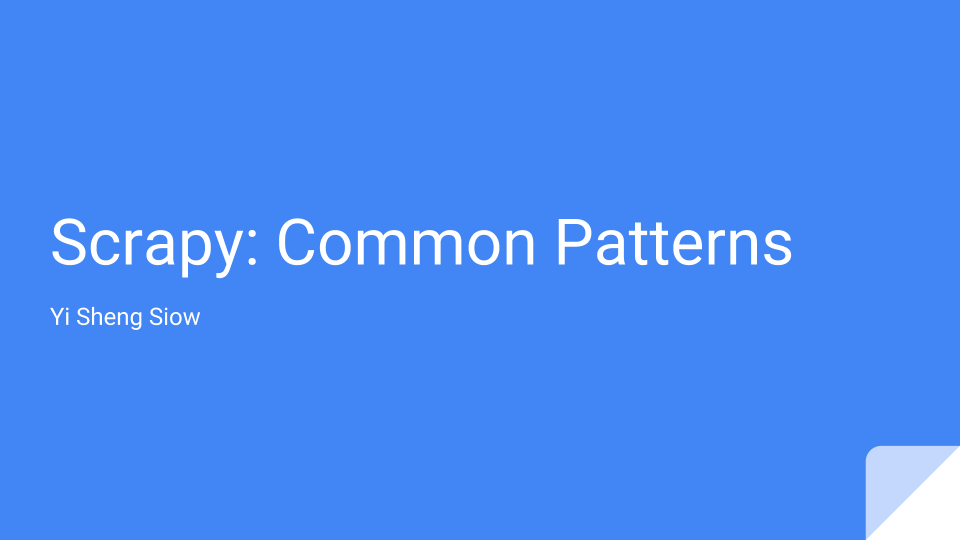
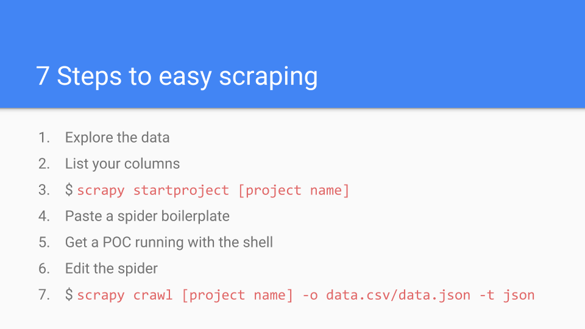
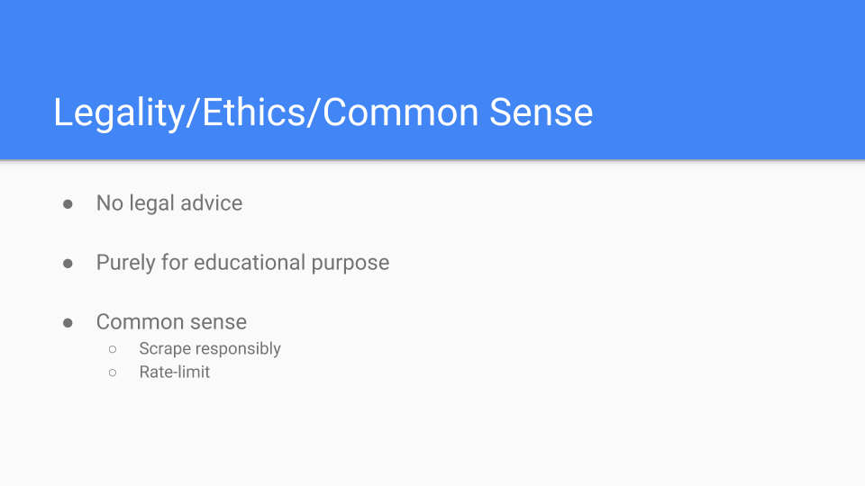
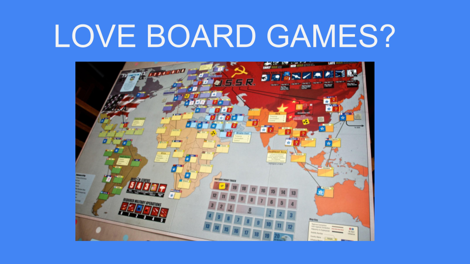
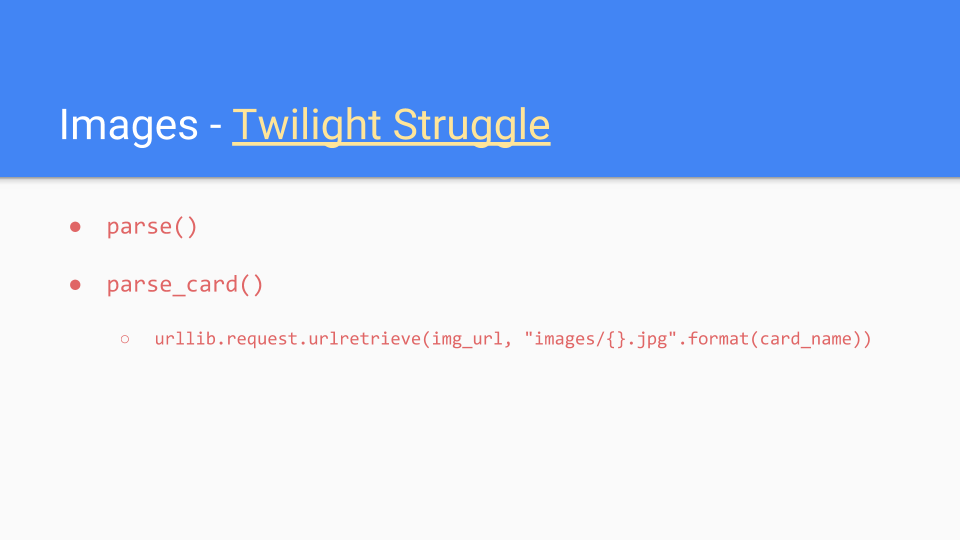

# scrapy-talk-20180627

Materials for the Scrapy: Common Patterns talk at Python User Group Singapore on 2018/06/27.

[Boilerplate for spiders](https://doc.scrapy.org/en/latest/intro/tutorial.html)

